# R-Project 1: Superstore Sales, Profit & Forecasting Analysis (R)

This project analyzes the **Superstore dataset (2011–2014)** to uncover insights about sales, profit, product performance, customer segments, and regional trends using **R**.  
It includes extensive **data cleaning**, **EDA visualizations**, **correlation analysis**, **boxplots**, and **ARIMA forecasting** for predicting 2015 sales and profit.

* **Dataset:** Superstore Dataset (Kaggle, 2011–2014)  
* **Tools:** R, tidyverse, ggplot2, corrplot, treemap, forecast  
* **Techniques:** Data wrangling, bar charts, scatterplots, density plots, tree maps, correlation matrices, boxplots, time-series forecasting  
* **Goal:** Understand the superstore’s historical performance and forecast next-year trends.

---

### 📁 Dataset Overview

The dataset contains 24+ columns including:

- **Sales, Profit, Discount, Quantity, Shipping Cost**  
- **Category, Sub-Category, Shipping Mode**  
- **Market, Region, Segment**  
- **Order & Ship Dates**

  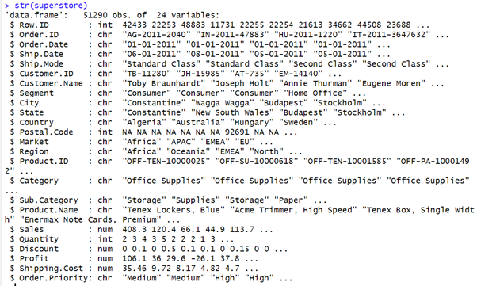
  
<em>Datatypes descriptions of the dataset.</em>

---

### 🧹 Data Cleaning & Preparation

#### ✔ Checked data types and structure  
#### ✔ Identified missing values  
Only “Postal Code” contains NA values — removed for analysis.

#### ✔ Created a clean dataset `new_superstore`  
Contains only rows/columns with **no missing values**.

  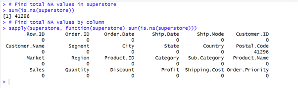
  
<em>NA inspection and clean dataset creation.</em>

---

### 📊 Orders & Customer Behavior

#### Total Orders by Market, Region, Ship Mode & Segment

  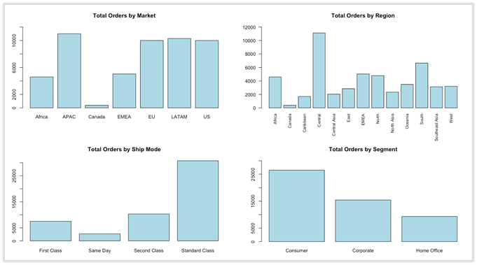
  
<em>Total Orders by Market, Region, Ship Mode & Segment</em>

- **APAC** and **Central** region show the highest order volumes.

---

### 💰 Sales & Profit by Market & Region

  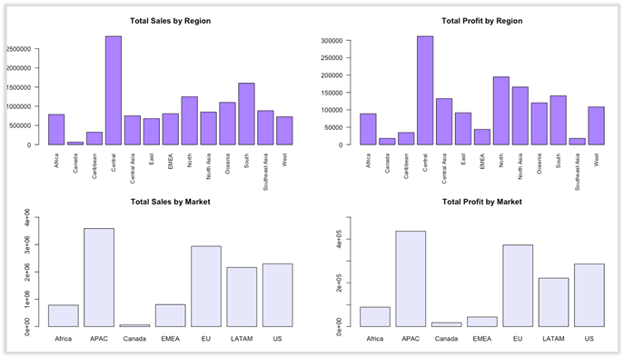

- **APAC** market and **Central** region perform best  
- **Canada** shows significantly lower sales & profit.

---

### 📦 Product Category & Subcategory Analysis

#### Orders by Category / Subcategory

  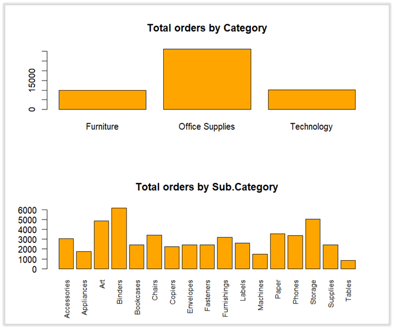

Top subcategories with highest order count:

- **Binders** (12%)  
- **Storage**  
- Lowest: **Tables** (~2%)

#### Pie Chart of Subcategory Orders

  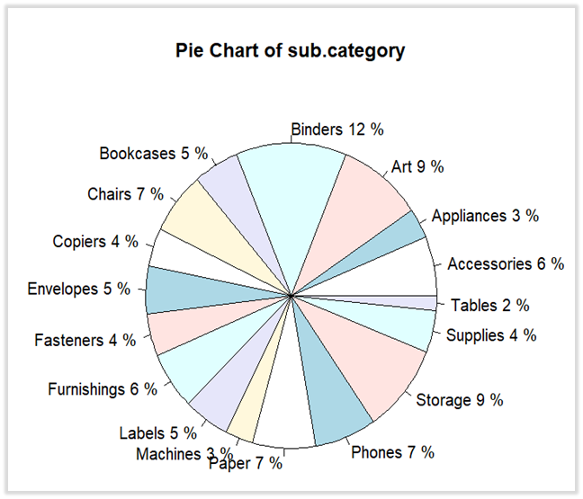

---

### 🧭 Sales & Profit by Category / Subcategory

  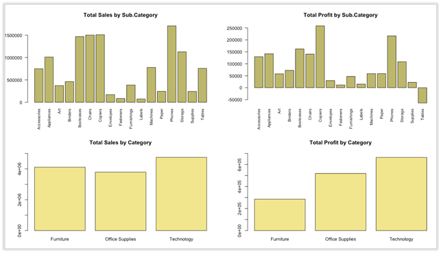

**Top findings:**

- **Phones** → highest sales  
- **Copiers** → highest profit  
- **Tables** → incurred losses  

---

### 🌳 Treemap Visualization

  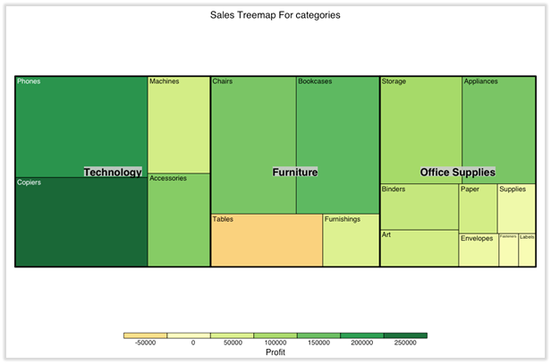
  
<em>Sales treemap by Category → Sub-Category</em>

---

### 🔍 Scatterplots

  

Observations:

- Sales vs Shipping Cost → **positive relationship**  
- Sales vs Profit → **weak linear relationship**  
- Discount heavily reduces profit  

---

### 📈 Density Plots

  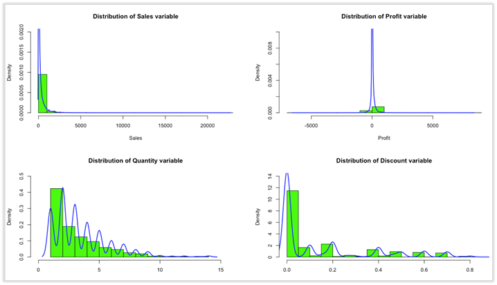

- Sales & Discount → right-skewed  
- Profit → slightly left-skewed  
- Quantity → peak around 1–2 units  

---

### 🔗 Correlation Analysis

  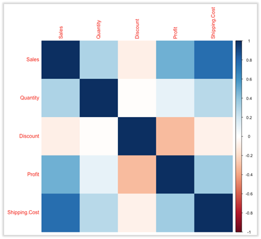

Key relationships:

- Sales ↔ Shipping Cost → **strong positive correlation**  
- Profit ↔ Discount → **negative correlation**  

---

### 📦 Boxplots

  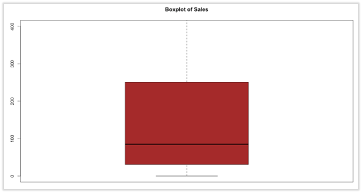

  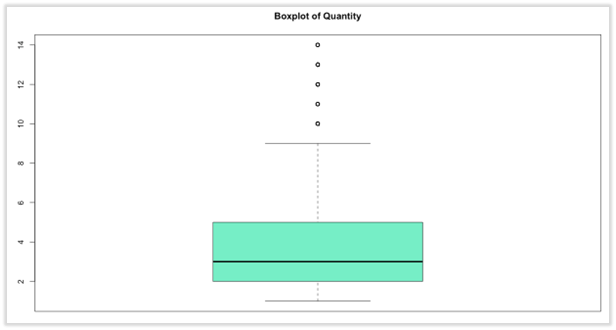

- Many outliers in Sales / Quantity / Discount  
- Quantity ranges from **1 → 14**  

---

### 📅 Monthly & Annual Trends

#### Annual Sales / Profit (2011–2014)

  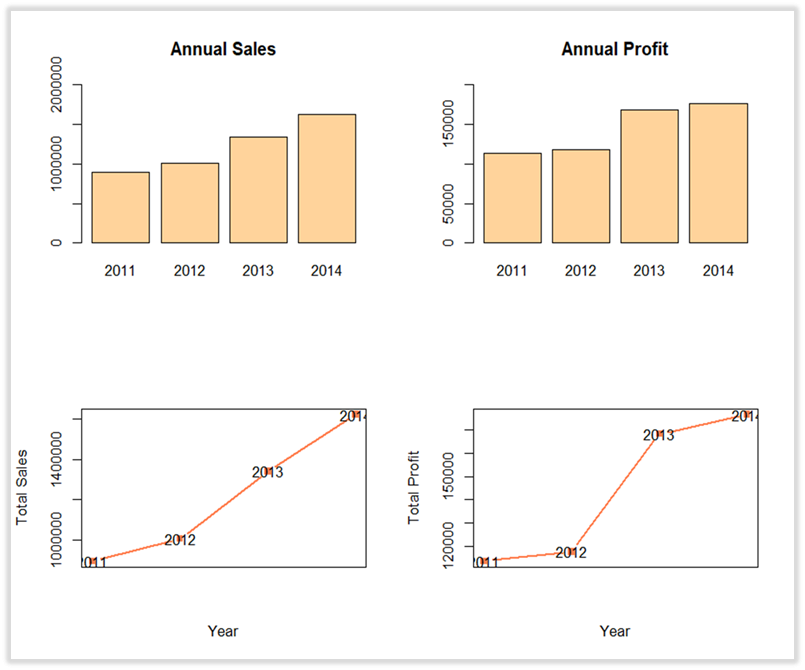

Both Sales & Profit show **yearly upward trends**.

---

#### 📆 Monthly Sales / Profit

  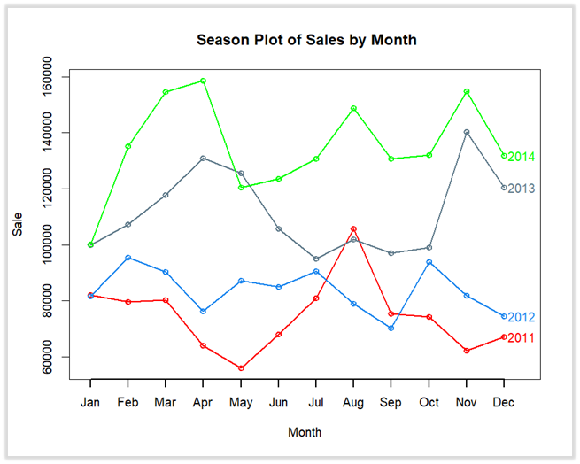

  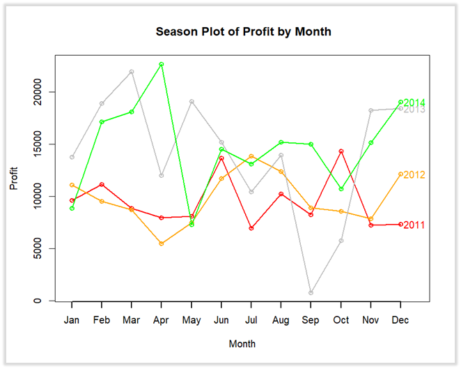

---

### 🔮 ARIMA Forecasting (2015)

Using monthly aggregated data:

- Fitted **Auto ARIMA** for Sales & Profit  
- Forecasted next 12 months  
- Confidence interval shown in grey

  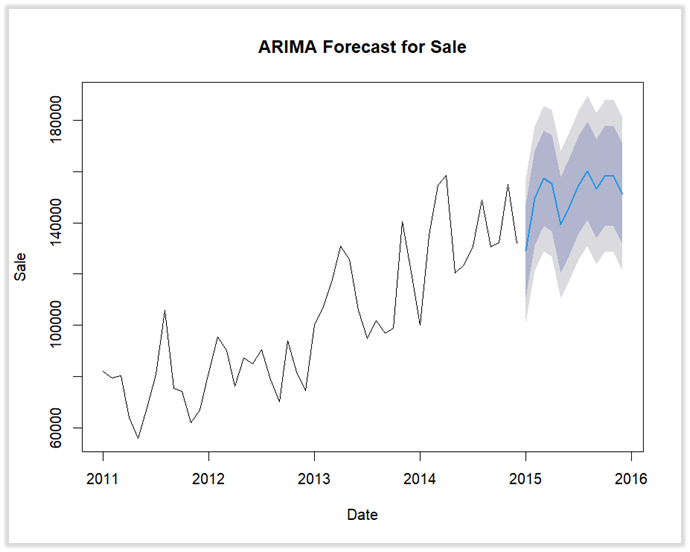

  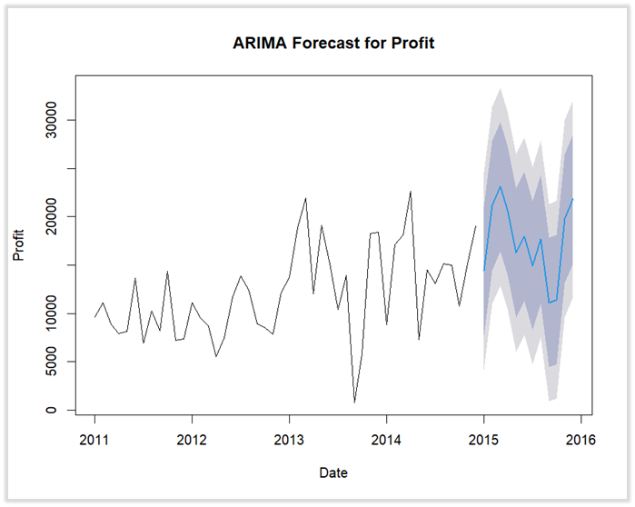

**Forecast Insight:**  
➡ 2015 sales and profit will continue rising, with seasonality similar to previous years.

---

### 🧠 Key Insights

- **APAC + Central** regions drive the most revenue  
- **Phones** (Technology) generate the highest sales  
- **Copiers** generate the highest profit  
- **Tables** consistently lose money  
- Discount negatively impacts profit  
- Yearly performance improves steadily  
- ARIMA forecast predicts **continued growth** in 2015  

---

### 🧠 Skills Demonstrated

- R data cleaning & wrangling  
- Visual analytics (bar charts, scatterplots, boxplots, density plots)  
- Correlation analysis & treemaps  
- Time series modeling with ARIMA  
- Interpreting patterns & forecasting future performance  

